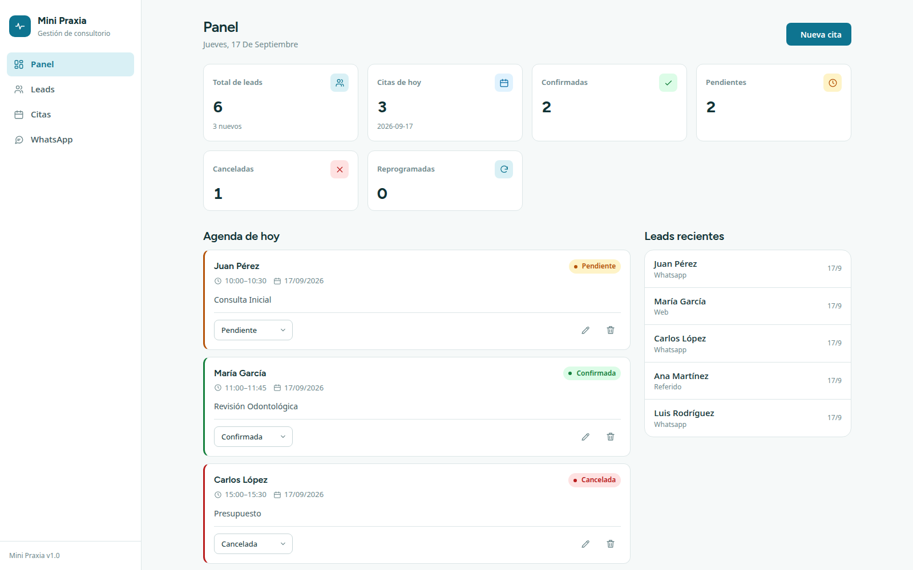
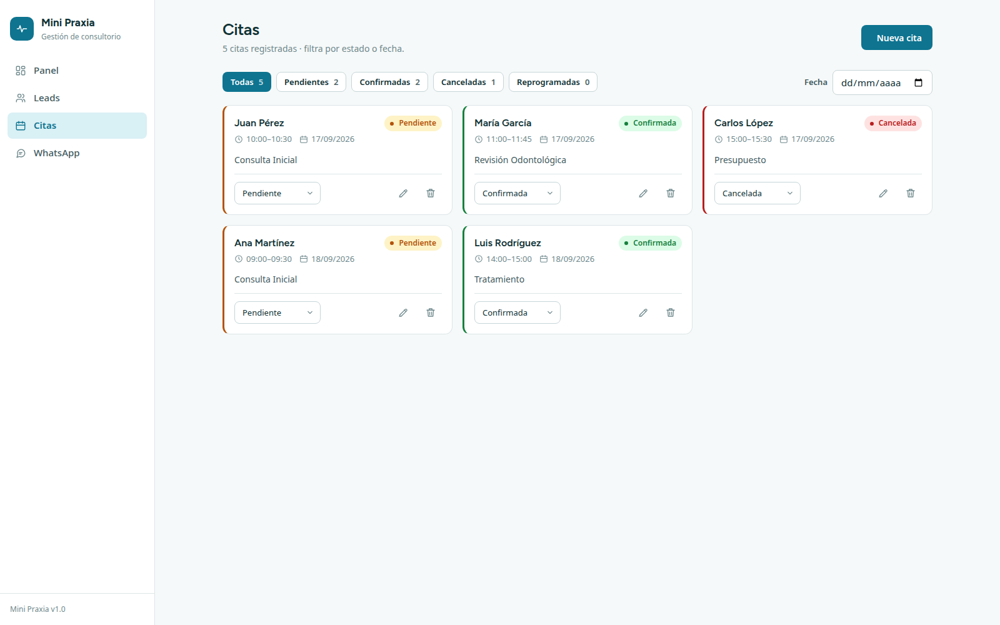
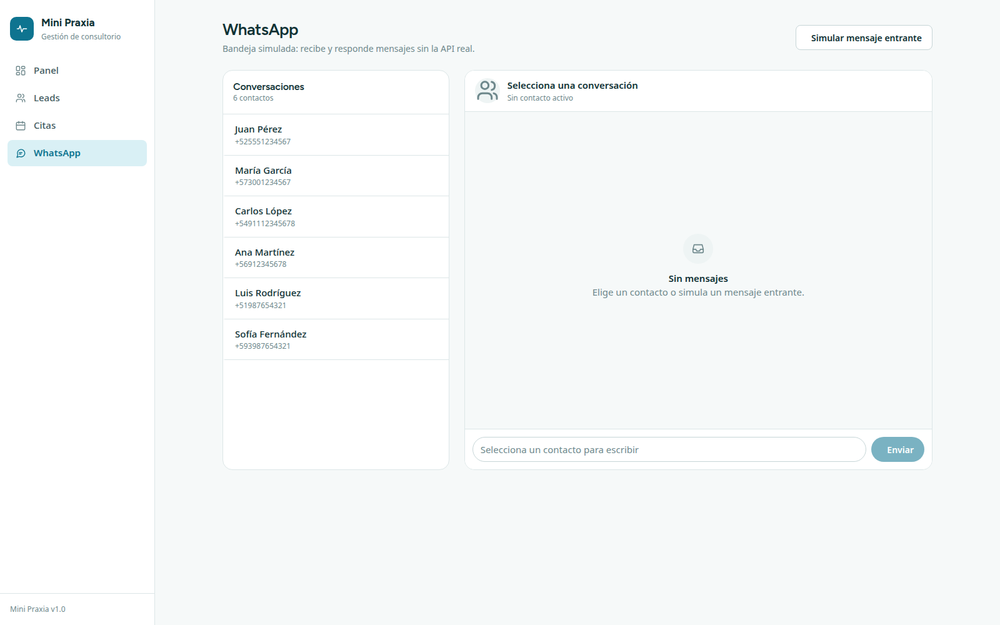

# Mini Praxia — Sistema de Gestión de Consultorio

Aplicación web para operar un consultorio: **leads (pacientes potenciales)**, **citas**
y **simulación de WhatsApp**, con panel de métricas del día.

Reto técnico Grupo 2 · 2 integrantes · 8 horas.



---

## Requisitos

- Node.js v18 o superior
- npm v9 o superior

## Ejecución

Dos procesos en paralelo. **Primero el backend.**

```bash
# terminal 1 — API
cd backend
npm install
npm run dev        # http://localhost:3001

# terminal 2 — interfaz
cd frontend
npm install
npm run dev        # http://localhost:5173
```

El frontend llama a `/api/...` y Vite lo redirige al backend (`vite.config.js`).
Si la API no está arriba, la interfaz mostrará errores de red en los toasts.

## Stack

| Capa | Tecnología |
| --- | --- |
| Frontend | React 18 + Vite + React Router |
| Estilos | CSS vanilla con tokens de diseño (`frontend/src/index.css`) |
| Backend | Node.js + Express |
| Datos | SQLite vía `sql.js` (archivo en `backend/data/clinica.db`) |

## Arquitectura

```
backend/
  server.js                 arranque, CORS, rutas, 404 JSON, manejador de errores
  database.js               esquema, datos semilla, helpers (getAll/getOne/runQuery)
  middleware/validation.js  validación de leads, citas y estados
  routes/                   leads.js · citas.js · whatsapp.js · dashboard.js

frontend/src/
  api/client.js             única capa de acceso a la API
  components/               Layout, Sidebar, Modal, ConfirmDialog, Toast,
                            MetricCard, StatusBadge, CitaCard, LeadTable,
                            LeadForm, CitaForm, WhatsAppSim, icons, ErrorBoundary
  pages/                    Dashboard · Leads · Citas · WhatsApp
  index.css                 tokens + componentes base
```

Decisiones de diseño: `docs/DESIGN_BRIEF.md`.

## Flujo del reto (punta a punta)

1. **Registrar un lead** (Leads → Nuevo lead).
2. **Recibir un mensaje de WhatsApp simulado** (WhatsApp → Simular mensaje entrante).
   Si el teléfono no existe, se crea el lead automáticamente.
3. **Agendar una cita** asociada al lead (Leads → calendario, o Citas → Nueva cita).
4. **Cambiar el estado** de la cita: pendiente, confirmada, cancelada o reprogramada.
5. **Panel**: citas de hoy, confirmadas, pendientes, canceladas, reprogramadas y total de leads.

### Validaciones visibles en la interfaz

| Caso | Dónde se ve |
| --- | --- |
| Campo obligatorio | Formularios de lead y cita (error junto al campo) |
| Teléfono duplicado | Crear lead con un teléfono ya registrado → toast de error |
| Cita duplicada / horario inválido | Agendar en un horario ocupado o con fin ≤ inicio |
| Mensaje repetido | Simular el mismo mensaje dos veces en menos de 2 minutos |

## API

| Recurso | Endpoints |
| --- | --- |
| Leads | `GET/POST /api/leads`, `GET/PUT/DELETE /api/leads/:id` |
| Citas | `GET/POST /api/citas`, `GET/PUT/DELETE /api/citas/:id`, `PATCH /api/citas/:id/estado` |
| WhatsApp | `POST /api/whatsapp/webhook`, `POST /api/whatsapp/enviar`, `GET /api/whatsapp/mensajes/:telefono` |
| Panel | `GET /api/dashboard/resumen`, `GET /api/dashboard/hoy` |
| Salud | `GET /api/health` |

Respuestas: `{ success: true, data }` o `{ error: true, message }`.

## Verificación

```bash
bash scripts/smoke.sh     # requiere el backend en :3001
```

Recorre el flujo completo por API (lead → cita → estado → WhatsApp → panel),
comprueba las validaciones y limpia los datos que crea.

```bash
cd frontend && npm run lint && npm run build
```

## Equipo — Grupo 2

| Integrante | Rol principal | Foco |
| --- | --- | --- |
| James M. | Frontend | Interfaz, dashboard, formularios, sistema de diseño, accesibilidad |
| Erick E. | Backend | API, reglas de negocio, persistencia, validaciones |

**Responsabilidad compartida:** ambos prueban el flujo completo y corrigen la integración
entre las partes. Detalle en `docs/EVIDENCIA_INDIVIDUAL.md`.



